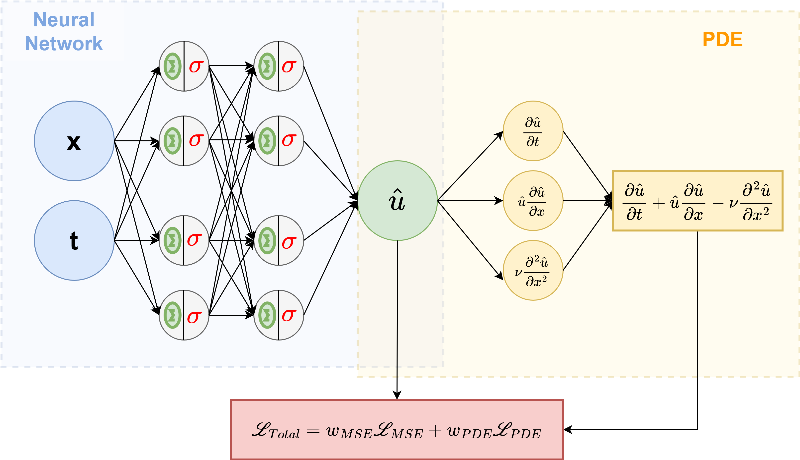

# Automated Physical Law discovery from Dta using Physics Informed Neural Networks (PINNs)

## Intro and Motivation

This is the repository of my Master Thesis titled **Automated Physical Law Discovery from data using Physics-Informed Deep Learning**. The final PDF version of my thesis is divided in 2 parts: **Thesis Intro.pdf** cover introdcutory chapters and **Thesis Work** covers the results and tecnhical wortk done. This repository has all the code used to produce the results in it.

My thesis is the result of a year-long internship in Flanders Make, a Research Center located in Leuven (Belgium), which tries to make bridge Research and Academia, and ,nowadays, works more on Automation, Optimization, and Machine Learning (Deep Learning  included) with focus on industrial settings.
The main goals of the internship were:

1. Understand what are PINNs: main concepts, advantages/disadvantages, use cases, and state-of-the-art techniques and implementations.
2. Use PINNs to determine the underlying Physical Laws of 2 systems: Axially Moving String and Weather.
3. Use PINNs to forecast the 2 previous system's behavior.

Here is a GIF showcasing a PINN forecasting a vibrating wire position, only having training data from $t=[0,2]s$ and predicting the wire's position for $t=[2,4]s$. We can see the predict power of PINNs when there isn't training data available.

## Structure and Guide 

This repository is divided in 2 folders, one for each system we used PINNs on: the axially moving string and the weather. Then, the *String* and *Weather* folders are divided into the *Notebooks* folder, and all the auxiliary folder which have data, images, saved model, and GIFs. The important folder are the *Notebook* ones, there is all the code used to get all the results shown in the Thesis.

All notebooks should be commented and accompanied by a small description of what they are supposed to do, but here is a small description of what the main notebooks do:

1. *String/notebooks*:
    1. *Full_Pipeline.ipynb* : Train a regular NN on an initial sub-set of the data, learn the PDE coefficients, re-train the NN with added PDE Loss (making it a regular PINN) on the second domain when there aren't labels available.
    2. *String_Data_generation.ipynb*: Generate and save simulated data of the axially moving string. Given string horizontal speed (v), string group velocity (c), spatial and time resolution generate a solution to the axially moving string PDE.
    3. *GIFs.ipynb*: Generate the string moving GIFs from data.
2. *Weather/Notebooks*:
    1. *Weather1D.ipynb*: Tackles the 1D Weather problem. Loads the Data and trains a PINN with Fourier Transform dominant frequencies.
    2. *Weather2D.ipynb*: Tackles the 2D Weather problem. Load the Data and trains a PINN using possible different approaches of Library of terms (ad-hoc, Bernard-Railegh convection mode). Shows PINNs failing to correctly forecast the 2D Weather.
 
I reccomend reading (skimming) the thesis and then experiment with notebooks **Full_Pipeline.ipynb**, **GIFs.ipynb**, and **Weather1D**.

## Acknowledgments

I want to thank all my supervisors: Agusmian, Erik, Kerem, Jeroen, and prof. João Pedroso for their guidance and help. 
